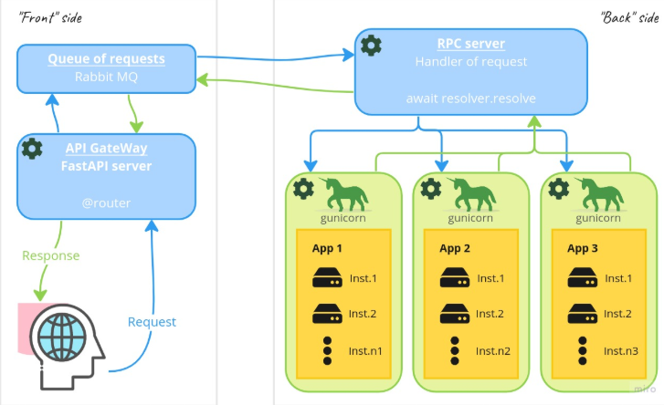

# VideoTranslator

Проект VideoTranslator предназначен для автоматического перевода видео с помощью обработки видеоматериалов, аудиодорожек и текста. Основные модули включают:

- **Обработчик фреймов** — извлечение и обработка кадров видео, например, для анализа или модификации изображений.
- **Обработчик аудио** — выделение и трансформация аудиодорожек, распознавание речи или преобразование звука.
- **Переводчик текста** — автоматический перевод текста, полученного из видео или аудио, на нужный язык.

Этот инструмент помогает автоматизировать процесс локализации видео контента, делать его более доступным для международной аудитории.

---

## Основные модули
- **Frame Processor**: извлечение кадров из видео, обработка изображений, создание слайд-шоу или подготовка данных для анализа.
- **Audio Processor**: извлечение аудиодорожек, преобразование звука, распознавание речи.
- **Text Translator**: перевод текста с одного языка на другой, интеграция с API переводчиков.

---

## Используемая версия Python

Рекомендуется использовать Python версии 3.12.5.  
Скачать можно по ссылке: [Python 3.12.5](https://www.python.org/downloads/release/python-3125/)

---

## Описание Нейронки
## 📊 Сравнение моделей OCR

| № | Модель | CER ↓ | WER ↓ | LER ↓ | EMR ↑ | Краткий вывод |
|---|---------|--------|--------|--------|--------|----------------|
| 1 | **DocTR_db_resnet50_crnn_vgg16_bn** | 0.865 | 0.971 | 0.971 | 0.029 | Наибольшее количество ошибок, почти все слова распознаны неверно. Требуется дообучение или улучшение предобработки. |
| 2 | **PP-OCRv5** | 0.624 | 0.510 | 0.510 | 0.490 | Лучшая модель среди сравниваемых: почти половина примеров распознана без ошибок. Хороший баланс метрик. |
| 3 | **EasyOCR** | 0.588 | 0.556 | 0.556 | 0.444 | Схожие результаты с PP-OCRv5, немного лучше по CER, но чуть хуже по EMR. Средний уровень точности. |

...

---

## Описание Фронта

...

---

## Бекенд архитектура



Бэкенд состоит из двух основных частей: API сервер и обработчики сервисов.
API сервер отвечает за обработку HTTP запросов и маршрутизацию.
Обработчики сервисов реализуют бизнес-логику и взаимодействие с внешними системами.

### Технологический стек

**Основные технологии:**
- **FastAPI** - современный, высокопроизводительный веб-фреймворк для построения API.
- **Python 3.12+** - актуальная версия Python.
- **Asyncio** - для асинхронной обработки I/O.
- **aio-pika** - асинхронный клиент для работы с RabbitMQ.
- **jsonrpcserver** - реализация JSON-RPC протокола для межсервисного взаимодействия.

**Дополнительные библиотеки:**
- **Pydantic v2** - валидация данных и управление настройками.
- **Uvicorn** - ASGI сервер для запуска приложения.
- **python-multipart** - обработка загрузки файлов.
- **aiofiles** - асинхронная работа с файловой системой.
- **fastsession** - управление сессиями с кастомным хранилищем.

### Структура проекта

```
src/
├── app.py                    # Главный файл, инициализация FastAPI
├── routes.py                 # Объединение всех роутеров
├── worker.py                 # Точка входа для запуска RabbitMQ воркера
├── config/                   # Конфигурация приложения
│   ├── app_config.py         # Основные настройки (размер файлов, порты)
│   ├── logging_config.py     # Настройка системы логирования
│   ├── rabbitmq_config.py    # Настройки RabbitMQ
│   └── services/             # Конфигурации для отдельных сервисов (auto-created)
│       ├── base_config.py    # Базовый шаблон конфигурации
│       ├── test_config.py    # Конфигурация тестового сервиса
│       └── ml_config.py      # Конфигурация ML сервиса
├── routers/                  # HTTP роутеры (endpoints)
│   ├── file_router.py        # Endpoints для работы с файлами
│   └── frontend_router.py    # Endpoints для фронтенда
├── services/                 # Бизнес-логика и сервисы
│   ├── base_service.py       # Базовый класс для всех сервисов
│   ├── test_service.py       # Тестовый сервис
│   └── ml_service/           # ML сервис для обработки
│       ├── ml_service.py     # Основная логика ML сервиса
│       └── ml_pipeline.py    # Пайплайн обработки
├── schemas/                  # Pydantic модели для валидации
│   └── base_schema.py        # Базовые схемы ответов
├── transport/                # Компоненты для межсервисного взаимодействия
│   ├── json_rpc/             # Реализация JSON-RPC
│   │   ├── dispatcher.py     # Основной диспетчер на базе jsonrpcserver
│   │   └── service_loader.py # Логика автообнаружения сервисов
│   └── rabbitmq/             # Компоненты для работы с RabbitMQ
│       ├── connection.py     # Менеджер соединений с переподключением
│       ├── consumer.py       # Логика консьюмера (RPC сервер)
│       └── producer.py       # Логика продюсера (RPC клиент, Direct Reply-to)
├── utils/                    # Утилиты
│   ├── custom_session_store.py # Кастомное хранилище сессий с очисткой
│   ├── files_utils.py        # Утилиты для работы с файлами
│   └── string_utils.py       # Утилиты для работы со строками
└── exceptions/               # Кастомные исключения
    └── rpc_exceptions.py     # RPC-специфичные исключения
```

### API сервер

API сервер реализован с использованием FastAPI и является точкой входа для всех HTTP запросов. Основные компоненты:

#### Инициализация приложения (`app.py`)

Приложение инициализируется через фабричную функцию `get_application()`, которая:
- Настраивает FastAPI с указанием названия проекта, версии и режима отладки
- Подключает все роутеры через централизованную функцию `get_apps_router()`
- Монтирует статические файлы из директории `public/` для обслуживания фронтенда
- Инициализирует систему логирования с настройками из конфигурации

```python
app = get_application()
# Запуск: uvicorn src.app:app --host 0.0.0.0 --port 8000
```

#### Система маршрутизации

Маршрутизация организована модульно через отдельные роутеры:

**Frontend Router** (`frontend_router.py`):
- Обслуживает главную страницу приложения
- Автоматически выдает HTML контент с поддержкой CSRF защиты
- Endpoint: `GET /` - возвращает `index.html`

**File Router** (`file_router.py`):
- Обрабатывает загрузку файлов от пользователей
- Endpoint: `POST /files/upload` - принимает multipart/form-data с файлом
- Валидирует размер файла (макс. 10MB по умолчанию)
- Возвращает метаданные загруженного файла (имя, тип, размер, время загрузки)
- Отправляет задачи на обработку в RabbitMQ через RPCProducer

#### Конфигурация (`config/`)

**Настройки приложения** (`app_config.py`):
Использует Pydantic Settings для управления конфигурацией с поддержкой `.env` файлов:
- `PROJECT_NAME` - название проекта
- `VERSION` - версия API
- `DEBUG` - режим отладки
- `LOG_LEVEL` - уровень логирования (DEBUG, INFO, WARNING, ERROR)
- `LOG_DIR` - директория для файлов логов
- `MAX_FILE_SIZE` - максимальный размер загружаемого файла (10MB)

**Настройки RabbitMQ** (`rabbitmq_config.py`):
Конфигурация подключения к брокеру сообщений:
- `RABBITMQ_HOST` - адрес сервера RabbitMQ
- `RABBITMQ_PORT` - порт подключения
- `RABBITMQ_USER` - имя пользователя
- `RABBITMQ_PASSWORD` - пароль
- `RABBITMQ_RPC_QUEUE` - имя очереди для RPC запросов
- `url` - полный URL подключения в формате AMQP

**Система логирования** (`logging_config.py`):
Комплексная система логирования с несколькими обработчиками:
- **Console Handler** - вывод в консоль для разработки
- **File Info Handler** - запись общих логов в `var/log/app.log` с ротацией (5 файлов по 10MB)
- **File Error Handler** - отдельный файл `var/log/error.log` только для ошибок
- Структурированный формат логов с временными метками, именем модуля и номером строки
- Специальная конфигурация для логгеров uvicorn и fastapi

#### Схемы данных (`schemas/`)

Используются Pydantic модели для валидации входящих и исходящих данных:

**BaseResponse** - базовая схема для всех ответов API:
```python
{
    "status": "success" | "error",
    "message": "Описание результата",
    "data": {...},  # Опциональные данные ответа
    "error": "Детали ошибки (если есть)"
}
```

#### Обработка ошибок

Реализована централизованная обработка исключений:
- HTTP ошибки выбрасываются через `HTTPException` с соответствующими статус-кодами
- Все неожиданные ошибки логируются с полным стек-трейсом
- Клиент получает структурированный JSON ответ даже при ошибках
- Используются стандартные HTTP статус-коды (400, 404, 500 и т.д.)
- RPC исключения определены в `src/exceptions/rpc_exceptions.py`

#### Управление сессиями

Система использует кастомное хранилище сессий `CustomSessionStore`:
- Расширяет `MemoryStore` из библиотеки `fastsession`
- Поддерживает callback-механизм для очистки файлов при удалении сессий
- Автоматическая сборка мусора (GC) для старых сессий
- Настраиваемое время жизни сессий (по умолчанию 12 часов)
- Позволяет выполнять дополнительные действия перед удалением сессии

### Обработчики сервисов (Workers)

Обработчики сервисов (воркеры) — это независимые асинхронные процессы, которые выполняют основную бизнес-логику. Они полностью отделены от API-сервера и взаимодействуют с ним через брокер сообщений RabbitMQ.

#### Архитектура сервисов и JSON-RPC

В основе архитектуры лежит механизм **JSON-RPC**, который позволяет стандартизировать вызовы методов сервисов.

- **`BaseService`**: Все сервисы наследуются от этого базового класса. Он отвечает за автоматическую загрузку конфигурации из `src/config/services/`. Если конфигурационный файл для сервиса отсутствует, он создается автоматически.
- **Автообнаружение сервисов**: `ServiceLoader` (`src/transport/json-rpc/service_loader.py`) при старте сканирует каталог `src/services/`, находит всех наследников `BaseService` и регистрирует их методы.
- **`JSONRPCDispatcher`**: Ядро, построенное на `jsonrpcserver`, которое принимает JSON-RPC запросы, находит нужный метод и выполняет его. Имя метода в RPC формируется из имени сервиса (например, `VideoProcessingService` -> `video_processing.execute`).
- **Контракт сервиса**: Каждый сервис должен реализовать метод `execute(data: dict)`, который и будет вызываться удаленно.

#### Взаимодействие через RabbitMQ

API-сервер и воркеры общаются через RabbitMQ, что обеспечивает асинхронность и масштабируемость.

- **`worker.py`**: Точка входа для запуска воркера как отдельного процесса (`python -m src.worker`). Воркер слушает очередь RabbitMQ.
- **`RPCConsumer`**: Компонент воркера, который принимает сообщения из очереди. При получении сообщения он передает его в `JSONRPCDispatcher` для выполнения соответствующего метода сервиса.
- **`RPCProducer`**: Компонент на стороне API-сервера, который отправляет задачи в очередь. Он использует паттерн **Direct Reply-to** для получения ответа от воркера без создания временных очередей.
- **`ConnectionManager`**: Управляет подключением к RabbitMQ и обеспечивает переподключение в случае сбоев.

#### Последовательность работы

1.  **API-сервер** (например, при загрузке файла) использует `RPCProducer` для отправки задачи в очередь RabbitMQ. Задача содержит имя метода (например, `video_processing.execute`) и параметры.
2.  **Воркер** (`RPCConsumer`) получает задачу из очереди.
3.  Содержимое задачи передается в **`JSONRPCDispatcher`**, который вызывает нужный метод у соответствующего сервиса.
4.  Сервис выполняет бизнес-логику (например, обработку видео).
5.  Результат выполнения возвращается API-серверу через `reply_to` очередь.
6.  API-сервер получает результат и может, при необходимости, уведомить клиента.

Эта архитектура позволяет горизонтально масштабировать воркеры: для увеличения производительности достаточно запустить больше экземпляров `worker.py`.

#### Пример RabbitMQ сообщения

Взаимодействие между API-сервером и воркерами происходит через JSON-RPC 2.0 запросы. Пример вызова тестового сервиса:

```python
from src.transport.rabbitmq.producer import RPCProducer

producer = RPCProducer()
await producer.connect()

result = await producer.call(
    method="test.execute",
    params={"data": {"message": "Hello from RabbitMQ!"}},
    timeout=10.0
)
# Результат: {'status': 'success', 'message': 'Test service received: ...', ...}
```

📖 **Подробная документация:** [docs/TEST_SERVICE_RABBITMQ_EXAMPLE.md](docs/TEST_SERVICE_RABBITMQ_EXAMPLE.md)

### Утилиты и Вспомогательные Компоненты

#### Утилиты для работы со строками (`utils/string_utils.py`)
- `to_snake_case()` - преобразование имен классов в snake_case формат
- Используется для автоматического формирования имен конфигурационных файлов

#### Утилиты для работы с файлами (`utils/files_utils.py`)
- Вспомогательные функции для работы с файловой системой
- Асинхронные операции с файлами

#### Кастомное хранилище сессий (`utils/custom_session_store.py`)
- Расширенная версия `MemoryStore` с поддержкой callback при удалении
- Автоматическая очистка старых сессий
- Настраиваемые параметры времени жизни и порогов GC

## Тестирование

### Тестирование RabbitMQ

Для проверки работы RabbitMQ интеграции запустите воркер и тест:

```powershell
# Терминал 1: Запуск воркера
python -m src.worker

# Терминал 2: Запуск теста
python test_rabbitmq.py
```

Тест проверяет вызовы через JSON-RPC и выводит результаты всех проверок.

---

## Установка и запуск

### Установка зависимостей

```powershell
pip install -r requirements.txt
```

### Запуск

```powershell
# Терминал 1: API-сервер
python -m src.app

# Терминал 2: Воркер для обработки задач
python -m src.worker
```

Приложение доступно по адресу: http://localhost:8000

📖 **Дополнительная документация:**
- [Примеры RabbitMQ сообщений](docs/TEST_SERVICE_RABBITMQ_EXAMPLE.md)
- [Архитектура проекта](docs/ARCHITECTURE.md)
